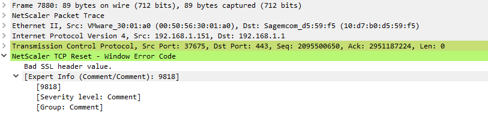

# Wireshark Lua Plugin to Enhance Packet Details View with NetScaler TCP Window Reset Codes

## 🚀 s of Wireshark 4.4.0 (28th August 2024) the functionality of this plugin is included by default within the TCP dissector  [(merge 16524)](https://gitlab.com/wireshark/wireshark/-/merge_requests/16524?commit_id=329845b000037e2b9d94c6db832283deac228517)

## Overview

This repository contains a Lua plugin for Wireshark that adds a new field to the packet details tree, specifically enhancing it with NetScaler TCP Window Reset Code Description. This plugin can be useful for custom analysis and dissection of network traffic related to NetScaler traffic.

## Features

- Adds a new custom field for NetScaler TCP Window Reset Codes to the packet details tree in Wireshark.
- Easily integrates with existing Wireshark installations.

## Requirements

- Wireshark 3.x or later
- Lua 5.1 or later

## Installation

### Step 1: Locate the Plugin Directories

The global directory for Lua plugins in Wireshark varies depending on your operating system, defaults are:

- **Windows**: `C:\Program Files\Wireshark\plugins\<version>\`
- **macOS**: `/Applications/Wireshark.app/Contents/Resources/share/wireshark/plugins/<version>/`
- **Linux**: `/usr/lib/wireshark/plugins/<version>/`

You can verify both plugin directories paths from within Wireshark:

1. Open Wireshark.
2. Go to `Help` > `About Wireshark`.
3. Click on the `Folders` tab.
4. Locate the `Personal Lua Plugins` or `Global Lua Plugins` directory.

### Step 3: Copy the Lua Plugin

Copy the Lua plugin file (`netscaler_tcp_window_reset_codes_plugin.lua`) into the identified plugin directory.

### Step 4: Enable the Lua Plugin

1. Restart Wireshark or press CTRL-SHIFT-L.

## Usage

After installation, Wireshark will automatically load the Lua plugin when it starts. The plugin will add a custom field for NetScaler TCP Window Reset Codes to the packet details tree.

### Example: Viewing the New Field

1. Open a saved NetScaler capture file. You can use the file [nstrace1.cap](example_trace/nstrace1.cap) and the Wireshark filter ``tcp.flags.reset == 1`` to see all packets with and without the new field.
2. Use the filter "(tcp.flags.reset == 1) && (tcp.window_size_value != 0)" to find NetScaler TCP Reset Packets.
3. In the packet details pane, you will see the new custom field called "NetScaler TCP Reset - Window Error Code" added by the Lua plugin.
4. Expand the new field. You will see the description along with the reset code. Sometimes the description is truncated, you can right-click to copy it. 

Example View:

Example Truncated View:

## Contributing

Contributions are welcome! 

## Buy Me a Coffee
If you like this work and would like to support future development, please consider buying me a coffee:

## License

This project is licensed under the MIT License. See the [LICENSE](LICENSE.txt) file for details.

## Contact

For any questions or support, please open an Issue.